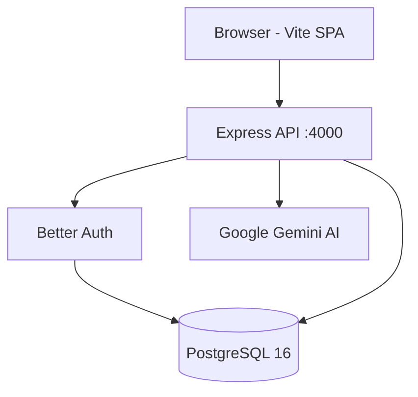

# Project Overview: Luma Loan Data Verification Copilot

## The Problem
Financial platforms rely on loan-level data, but this data is rarely clean. It comes from various sources (CSVs, APIs, legacy systems) and often contains errors, missing fields, duplicates, or conflicting information. Luma acts as a verification layer to transform this messy data into clean, trusted, and auditable records.

## Core Value Proposition
Luma is an AI-assisted full-stack console that:
1. **Ingests** messy loan records (e.g., CSVs) reliably.
2. **Validates** data using a configurable engine.
3. **Manages** exceptions with a human-in-the-loop AI assistant.
4. **Produces** a traceable, verified loan record with a cryptographic hash.

## System Architecture Diagram

## User Roles
- **Data Operator**: Uploads CSVs, views import history, and tracks validation summaries.
- **Reviewer**: Manages the exception queue, interacts with the AI assistant to resolve issues, and approves/rejects loans.
- **Data Consumer**: Accesses the final verified records, exports data, and views the audit trail.
