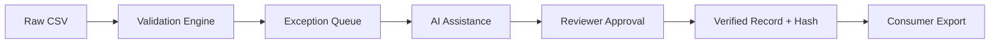

# Audit Trail, Security & Traceability

Trust is the most critical component of financial data. Luma guarantees traceability from raw CSV ingestion to the final verified record.

## 1. Immutable Audit Log
Luma maintains an append-only `AuditLog` table. Every business-state mutation is recorded inside the same database transaction as the change itself.
- **Events Tracked**: `FILE_UPLOADED`, `LOAN_IMPORTED`, `VALIDATION_RUN`, `EXCEPTION_CREATED`, `AI_RECOMMENDATION`, `REVIEWER_COMMENT`, `FIELD_EDITED`, `LOAN_APPROVED`, `VERIFIED_RECORD_CREATED`, etc.
- **No Deletes/Updates**: The audit log cannot be modified, providing a chronologically accurate history of every loan.

## 2. Cryptographic Hashing
When all exceptions for a loan are resolved, a Reviewer can "Verify" the loan.
- The system generates a `canonicalData` JSON snapshot of the final, clean fields.
- A **SHA-256 Hash** (`recordHash`) is generated from this canonical data.
- This ensures data integrity—any future downstream tampering can be detected by re-hashing the data.

## 3. Role-Based Access Control (RBAC)
Security is enforced at the API layer using **Better Auth**.
- **Authentication**: `HttpOnly`, `SameSite=Lax` cookie sessions prevent XSS attacks.
- **Authorization**: Middleware (`requireRole`) restricts endpoints. For example, only a `reviewer` can mutate an exception or verify a loan. Only a `data_consumer` can export verified records.

## End-to-End Verification Flow

